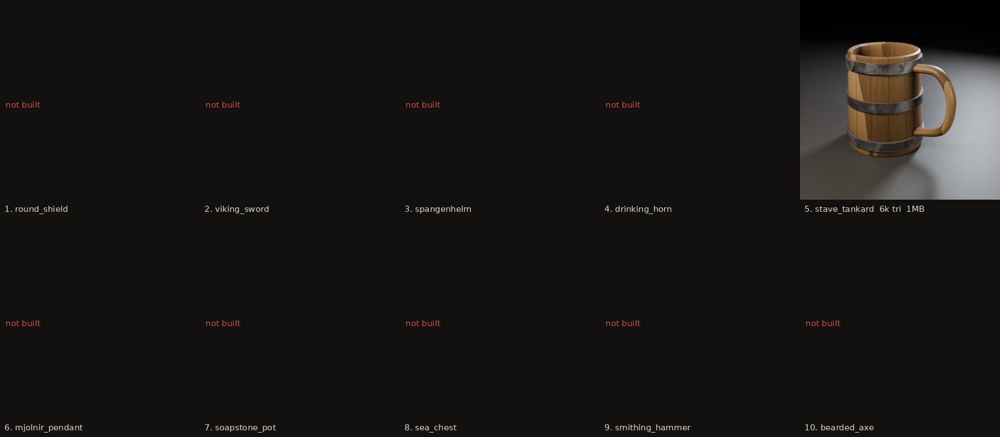
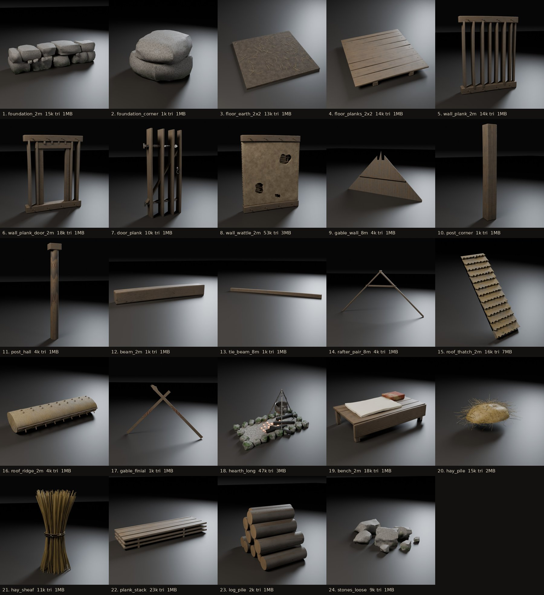
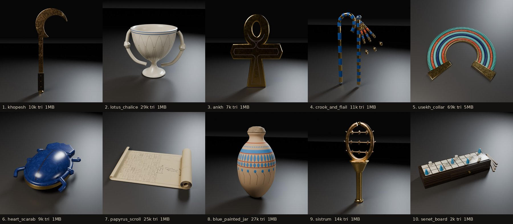
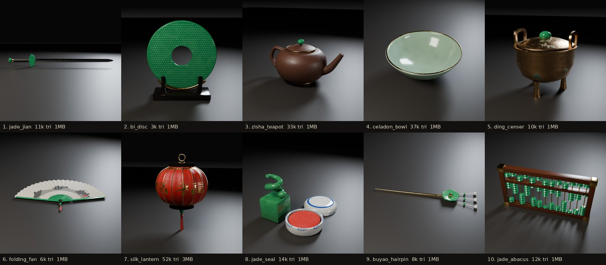
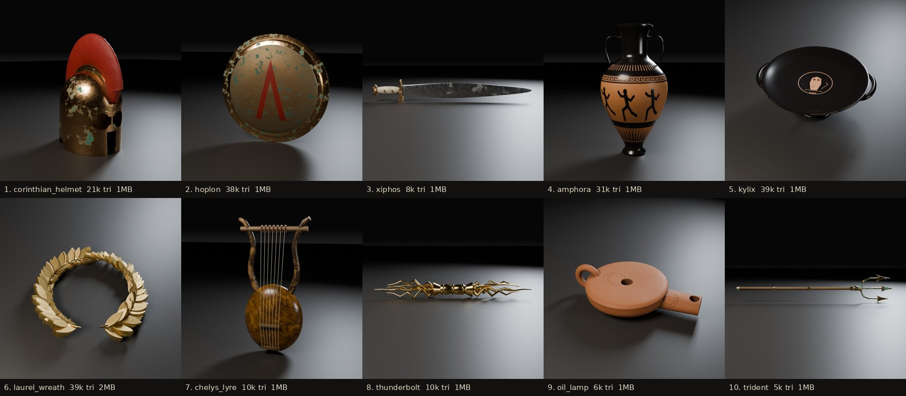
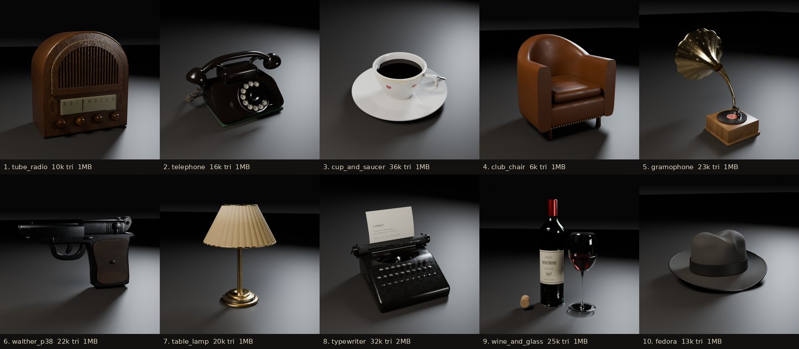
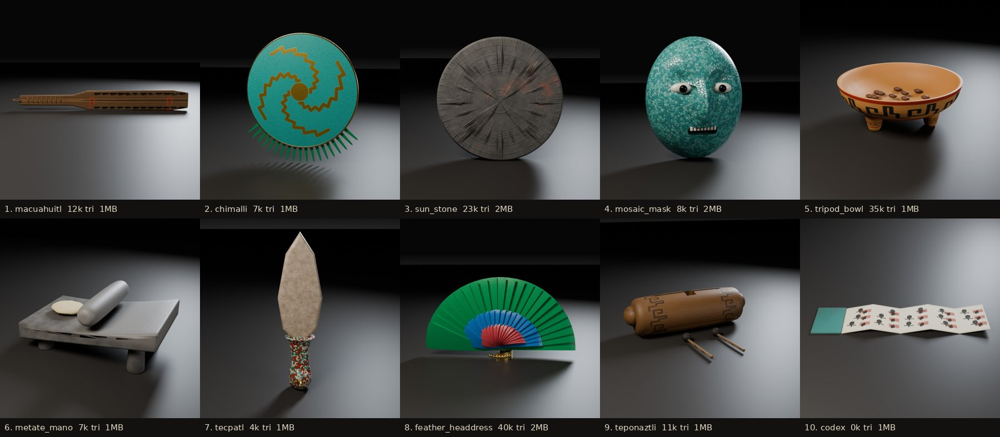

# 3D asset library

Procedurally generated, game-ready glTF 2.0 assets (PBR metallic-roughness, one baked texture set per asset: base colour, ORM, tangent-space normal; real-world scale in metres; +Y up).

Everything is regenerated from code: `python3 -m forge.runner` (see `assets/forge/`).

## Nordic / Viking age

c. 800-1050 AD. Weapons, armour, drinking gear, tools.

| Asset | File | Size (m) | Triangles | Texture | GLB |
|---|---|---|---|---|---|
| Bearded axe | `nordic/bearded_axe.glb` | 0.20 x 0.04 x 0.71 | 32,868 | 2048 px | 1.7 MB |
| Drinking horn | `nordic/drinking_horn.glb` | 0.28 x 0.12 x 0.41 | 31,636 | 2048 px | 1.8 MB |
| Mjolnir pendant | `nordic/mjolnir_pendant.glb` | 0.05 x 0.01 x 0.04 | 10,636 | 1024 px | 0.8 MB |
| Round shield | `nordic/round_shield.glb` | 0.85 x 0.12 x 0.85 | 12,420 | 2048 px | 1.1 MB |
| Sea chest | `nordic/sea_chest.glb` | 0.88 x 0.47 x 0.39 | 8,848 | 2048 px | 1.4 MB |
| Smithing hammer | `nordic/smithing_hammer.glb` | 0.13 x 0.04 x 0.35 | 6,220 | 1024 px | 0.3 MB |
| Soapstone pot | `nordic/soapstone_pot.glb` | 0.36 x 0.32 x 0.32 | 14,396 | 1024 px | 0.7 MB |
| Spangenhelm | `nordic/spangenhelm.glb` | 0.21 x 0.25 x 0.25 | 25,174 | 2048 px | 2.0 MB |
| Stave tankard | `nordic/stave_tankard.glb` | 0.20 x 0.14 x 0.16 | 6,252 | 1024 px | 0.5 MB |
| Viking sword | `nordic/viking_sword.glb` | 0.12 x 0.03 x 0.93 | 31,404 | 2048 px | 2.1 MB |

## Viking hall - modular kit

Building kit for a longhouse / mead hall (see metrics below).

| Asset | File | Size (m) | Triangles | Texture | GLB |
|---|---|---|---|---|---|
| Beam 2m | `viking_hall/beam_2m.glb` | 2.00 x 0.24 x 0.25 | 1,448 | 1024 px | 0.6 MB |
| Sleeping bench 2m | `viking_hall/bench_2m.glb` | 2.00 x 1.15 x 0.57 | 18,080 | 2048 px | 2.2 MB |
| Plank door | `viking_hall/door_plank.glb` | 0.92 x 0.15 x 1.84 | 10,132 | 1024 px | 0.9 MB |
| Floor earth 2x2 | `viking_hall/floor_earth_2x2.glb` | 2.00 x 2.00 x 0.07 | 13,188 | 2048 px | 1.8 MB |
| Floor planks 2x2 | `viking_hall/floor_planks_2x2.glb` | 2.00 x 2.01 x 0.19 | 14,416 | 2048 px | 2.1 MB |
| Foundation 2m | `viking_hall/foundation_2m.glb` | 2.06 x 0.63 x 0.52 | 24,000 | 2048 px | 3.3 MB |
| Foundation corner | `viking_hall/foundation_corner.glb` | 0.71 x 0.73 x 0.49 | 7,680 | 1024 px | 0.8 MB |
| Gable dragon finials | `viking_hall/gable_finial.glb` | 0.12 x 9.58 x 6.38 | 2,572 | 2048 px | 0.9 MB |
| Gable wall 8m | `viking_hall/gable_wall_8m.glb` | 0.16 x 8.01 x 3.79 | 7,704 | 2048 px | 2.0 MB |
| Hay pile | `viking_hall/hay_pile.glb` | 2.35 x 1.85 x 1.09 | 15,208 | 2048 px | 2.7 MB |
| Hay sheaf | `viking_hall/hay_sheaf.glb` | 0.47 x 0.48 x 0.98 | 11,276 | 1024 px | 1.1 MB |
| Long hearth | `viking_hall/hearth_long.glb` | 2.29 x 1.26 x 1.26 | 33,512 | 2048 px | 3.2 MB |
| Firewood pile | `viking_hall/log_pile.glb` | 0.63 x 0.79 x 0.57 | 2,520 | 2048 px | 1.3 MB |
| Plank stack | `viking_hall/plank_stack.glb` | 2.40 x 0.82 x 0.29 | 23,088 | 2048 px | 2.9 MB |
| Corner post | `viking_hall/post_corner.glb` | 0.29 x 0.29 x 2.50 | 1,448 | 1024 px | 0.6 MB |
| Carved hall post | `viking_hall/post_hall.glb` | 0.50 x 0.36 x 4.00 | 4,648 | 2048 px | 1.5 MB |
| Rafter pair 8m | `viking_hall/rafter_pair_8m.glb` | 0.39 x 9.39 x 4.85 | 4,704 | 2048 px | 1.6 MB |
| Ridge 2m | `viking_hall/roof_ridge_2m.glb` | 2.09 x 2.10 x 1.44 | 7,020 | 2048 px | 2.3 MB |
| Thatch roof 2m | `viking_hall/roof_thatch_2m.glb` | 2.06 x 4.94 x 4.89 | 28,152 | 4096 px | 11.8 MB |
| Fieldstones | `viking_hall/stones_loose.glb` | 1.22 x 1.48 x 0.29 | 9,984 | 2048 px | 2.5 MB |
| Tie beam 8m | `viking_hall/tie_beam_8m.glb` | 0.32 x 8.60 x 0.33 | 1,688 | 2048 px | 1.0 MB |
| Wall plank 2m | `viking_hall/wall_plank_2m.glb` | 2.01 x 0.32 x 2.51 | 14,416 | 2048 px | 2.5 MB |
| Wall plank door 2m | `viking_hall/wall_plank_door_2m.glb` | 2.01 x 0.32 x 2.51 | 18,760 | 2048 px | 2.7 MB |
| Wall wattle and daub 2m | `viking_hall/wall_wattle_2m.glb` | 2.01 x 0.32 x 2.51 | 54,518 | 2048 px | 3.7 MB |

### Kit metrics (viking_hall)

| Rule | Value |
|---|---|
| Grid | 2 m along the hall (X). Span 8 m, outer wall lines at y = -4 / +4 |
| Stone plinth | z 0 - 0.5 (`foundation_2m`, `foundation_corner`) |
| Floor level | z = 0.5 (`floor_*_2x2`, top surface at the pivot) |
| Walls | 2.5 m, base on the plinth, top plate at z = 3.0 |
| Roof | 45 deg, 0.6 m eave overhang, ridge at z = 7.0. Place roof pieces at z = 3.0 |
| Hall posts | two rows at y = +-2, 4.0 m tall on the floor; purlins (`beam_2m`) on top at z = 4.5 |
| Door | `door_plank` hinges at local (0.57, 0, 0.22) of `wall_plank_door_2m` |
| Opposite roof slope | `roof_thatch_2m` rotated 180 deg about Z, shifted +2 m in X |

Pivots sit exactly on the snapping point (module start on the wall centre line,
or footprint centre for posts and props).

## Ancient Egypt

New Kingdom. Regalia, amulets, vessels, a senet board, a papyrus with real hieroglyphs.

| Asset | File | Size (m) | Triangles | Texture | GLB |
|---|---|---|---|---|---|
| Ankh | `egypt/ankh.glb` | 0.18 x 0.01 x 0.25 | 7,520 | 2048 px | 0.9 MB |
| Blue-painted jar | `egypt/blue_painted_jar.glb` | 0.32 x 0.32 x 0.60 | 27,008 | 2048 px | 1.5 MB |
| Crook and flail | `egypt/crook_and_flail.glb` | 0.20 x 0.08 x 0.34 | 11,224 | 2048 px | 1.3 MB |
| Heart scarab | `egypt/heart_scarab.glb` | 0.05 x 0.07 x 0.03 | 9,072 | 1024 px | 0.5 MB |
| Khopesh | `egypt/khopesh.glb` | 0.22 x 0.03 x 0.59 | 10,212 | 2048 px | 1.0 MB |
| Lotus chalice | `egypt/lotus_chalice.glb` | 0.24 x 0.17 x 0.18 | 29,368 | 2048 px | 1.6 MB |
| Papyrus scroll | `egypt/papyrus_scroll.glb` | 0.38 x 0.26 x 0.05 | 25,844 | 2048 px | 1.8 MB |
| Senet board | `egypt/senet_board.glb` | 0.43 x 0.17 x 0.09 | 2,980 | 2048 px | 0.7 MB |
| Sistrum | `egypt/sistrum.glb` | 0.13 x 0.07 x 0.30 | 14,608 | 1024 px | 0.8 MB |
| Usekh collar | `egypt/usekh_collar.glb` | 0.35 x 0.31 x 0.01 | 69,780 | 2048 px | 5.4 MB |

## Jade Dynasty

Modern imperial China: polished jade, gold, black lacquer, celadon.

| Asset | File | Size (m) | Triangles | Texture | GLB |
|---|---|---|---|---|---|
| Bi disc on stand | `jade_dynasty/bi_disc.glb` | 0.20 x 0.06 x 0.23 | 3,520 | 2048 px | 0.9 MB |
| Buyao hairpin | `jade_dynasty/buyao_hairpin.glb` | 0.23 x 0.05 x 0.01 | 8,748 | 1024 px | 0.6 MB |
| Celadon bowl | `jade_dynasty/celadon_bowl.glb` | 0.20 x 0.20 x 0.08 | 37,376 | 1024 px | 1.5 MB |
| Bronze ding censer | `jade_dynasty/ding_censer.glb` | 0.23 x 0.23 x 0.23 | 10,760 | 2048 px | 1.1 MB |
| Folding fan | `jade_dynasty/folding_fan.glb` | 0.49 x 0.33 x 0.02 | 6,424 | 2048 px | 1.2 MB |
| Jade abacus | `jade_dynasty/jade_abacus.glb` | 0.30 x 0.02 x 0.16 | 12,308 | 2048 px | 1.8 MB |
| Jade jian | `jade_dynasty/jade_jian.glb` | 0.12 x 0.03 x 0.97 | 11,552 | 2048 px | 0.8 MB |
| Jade seal and cinnabar box | `jade_dynasty/jade_seal.glb` | 0.14 x 0.17 x 0.10 | 14,904 | 2048 px | 1.0 MB |
| Silk lantern | `jade_dynasty/silk_lantern.glb` | 0.29 x 0.29 x 0.43 | 52,640 | 2048 px | 3.6 MB |
| Zisha teapot | `jade_dynasty/zisha_teapot.glb` | 0.23 x 0.15 x 0.12 | 33,288 | 2048 px | 1.7 MB |

## Greece / Olympus

Archaic-Classical. Hoplite gear, painted pottery, divine attributes.

| Asset | File | Size (m) | Triangles | Texture | GLB |
|---|---|---|---|---|---|
| Black-figure amphora | `greece/amphora.glb` | 0.32 x 0.32 x 0.62 | 31,608 | 2048 px | 1.6 MB |
| Chelys lyre | `greece/chelys_lyre.glb` | 0.26 x 0.07 x 0.50 | 10,288 | 2048 px | 1.2 MB |
| Corinthian helmet | `greece/corinthian_helmet.glb` | 0.20 x 0.33 x 0.38 | 21,154 | 2048 px | 1.6 MB |
| Hoplon shield | `greece/hoplon.glb` | 0.91 x 0.10 x 0.91 | 38,824 | 2048 px | 1.8 MB |
| Red-figure kylix | `greece/kylix.glb` | 0.28 x 0.25 x 0.09 | 39,560 | 2048 px | 1.6 MB |
| Golden laurel wreath | `greece/laurel_wreath.glb` | 0.26 x 0.24 x 0.05 | 39,384 | 1024 px | 2.2 MB |
| Terracotta oil lamp | `greece/oil_lamp.glb` | 0.15 x 0.10 x 0.04 | 6,464 | 1024 px | 0.4 MB |
| Thunderbolt of Zeus | `greece/thunderbolt.glb` | 0.09 x 0.09 x 0.72 | 10,520 | 2048 px | 1.7 MB |
| Trident of Poseidon | `greece/trident.glb` | 0.27 x 0.06 x 1.55 | 5,468 | 2048 px | 0.8 MB |
| Xiphos | `greece/xiphos.glb` | 0.09 x 0.04 x 0.61 | 8,044 | 2048 px | 0.7 MB |

## Occupied Paris 1940-44

A comfortable bourgeois apartment: devices, tableware, furniture.

| Asset | File | Size (m) | Triangles | Texture | GLB |
|---|---|---|---|---|---|
| Leather club chair | `paris_1940/club_chair.glb` | 0.78 x 0.70 x 0.83 | 6,932 | 2048 px | 0.8 MB |
| Limoges cup and saucer | `paris_1940/cup_and_saucer.glb` | 0.18 x 0.18 x 0.06 | 36,128 | 1024 px | 1.3 MB |
| Felt fedora | `paris_1940/fedora.glb` | 0.33 x 0.29 x 0.15 | 13,696 | 2048 px | 1.2 MB |
| Horn gramophone | `paris_1940/gramophone.glb` | 0.52 x 0.72 x 0.83 | 23,356 | 2048 px | 1.8 MB |
| Art deco table lamp | `paris_1940/table_lamp.glb` | 0.35 x 0.35 x 0.47 | 20,412 | 2048 px | 1.8 MB |
| Bakelite telephone | `paris_1940/telephone.glb` | 0.30 x 0.22 x 0.15 | 16,216 | 2048 px | 1.6 MB |
| Art deco tube radio | `paris_1940/tube_radio.glb` | 0.38 x 0.25 x 0.41 | 10,884 | 2048 px | 1.5 MB |
| Portable typewriter | `paris_1940/typewriter.glb` | 0.38 x 0.31 x 0.29 | 32,578 | 2048 px | 2.7 MB |
| Walther P38 | `paris_1940/walther_p38.glb` | 0.21 x 0.04 x 0.14 | 6,632 | 2048 px | 1.2 MB |
| Bordeaux bottle and glass | `paris_1940/wine_and_glass.glb` | 0.22 x 0.13 x 0.32 | 25,940 | 2048 px | 1.3 MB |

## Aztec jungle

Mexica, c. 1400-1521. Obsidian weapons, mosaics, featherwork, daily tools.

| Asset | File | Size (m) | Triangles | Texture | GLB |
|---|---|---|---|---|---|
| Chimalli feather shield | `aztec/chimalli.glb` | 0.70 x 0.02 x 0.79 | 7,332 | 2048 px | 1.2 MB |
| Screenfold codex | `aztec/codex.glb` | 1.00 x 0.21 x 0.16 | 268 | 2048 px | 0.6 MB |
| Quetzal feather headdress | `aztec/feather_headdress.glb` | 1.17 x 0.68 x 0.73 | 65,808 | 2048 px | 3.6 MB |
| Macuahuitl | `aztec/macuahuitl.glb` | 0.15 x 0.06 x 0.96 | 12,052 | 2048 px | 1.4 MB |
| Metate and mano | `aztec/metate_mano.glb` | 0.46 x 0.30 x 0.20 | 7,488 | 2048 px | 1.3 MB |
| Turquoise mosaic mask | `aztec/mosaic_mask.glb` | 0.17 x 0.10 x 0.19 | 22,682 | 2048 px | 3.2 MB |
| Sun stone | `aztec/sun_stone.glb` | 0.60 x 0.09 x 0.60 | 23,040 | 2048 px | 2.9 MB |
| Tecpatl ritual knife | `aztec/tecpatl.glb` | 0.08 x 0.06 x 0.32 | 4,828 | 2048 px | 1.3 MB |
| Teponaztli slit drum | `aztec/teponaztli.glb` | 0.60 x 0.43 x 0.18 | 11,062 | 2048 px | 1.2 MB |
| Tripod bowl | `aztec/tripod_bowl.glb` | 0.28 x 0.28 x 0.11 | 35,152 | 2048 px | 1.8 MB |

## Engine notes

- **Unity**: glTFast or UnityGLTF. **Unreal 5**: built-in glTF importer (Interchange). **Godot 4**: native. **three.js / Babylon**: GLTFLoader.
- Normal maps are OpenGL-style (+Y). Flip green for DirectX-convention pipelines.
- Glass, liquids and embers use separate untextured materials (transmission / emission).

_84 assets._
