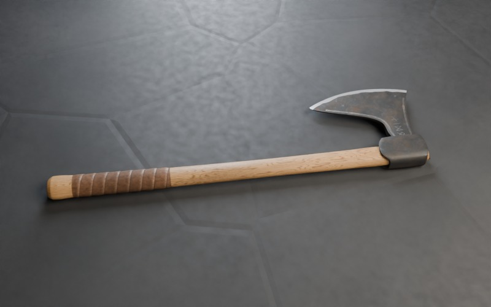
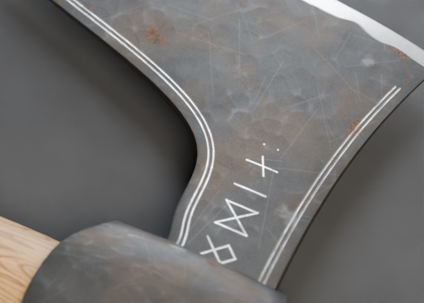

# Norse bearded axe (skeggøx)

Game-ready, PBR-textured 3D model of a Viking-age bearded axe. The iron head
carries silver-inlaid Elder Futhark runes **ᛟᛞᛁᚾ** (ODIN), and the haft is
oiled ash wood with a spiral leather grip.




## Files

| File | Purpose |
|---|---|
| `norse_axe.glb` | **Use this in the engine.** Self-contained glTF 2.0 binary with embedded textures. |
| `norse_axe.blend` | Blender 5.0 source scene |
| `textures/` | Separate PBR maps if you want to rebuild the materials by hand |
| `previews/` | Cycles renders |
| `src/` | Scripts that generate everything procedurally |

## Specs

- Real-world scale in metres: about 71 cm long, 20 cm across the head.
- Axes: glTF standard (+Y up). The haft runs along Y, the cutting edge points to +X.
- **Pivot is in the middle of the leather grip**, so you can parent it to a hand bone or socket without offsets.
- About 33k triangles in one mesh with 3 materials: `Iron`, `AshWood`, `Leather`.
- Metallic/roughness PBR workflow. Normal maps use the OpenGL/glTF convention (+Y). Occlusion is packed into R of the ORM map.

| Texture set | Resolution | Maps |
|---|---|---|
| Iron | 2048 × 2048 | basecolor, ORM, normal |
| Ash wood | 512 × 4096 (cylindrical unwrap) | basecolor, ORM, normal |
| Leather | 1024 × 1024 | basecolor, ORM, normal |

### Engine notes
- **Unity:** import with the glTFast package (or UnityGLTF). URP and HDRP Lit materials are created automatically.
- **Unreal 5:** use the built-in glTF Importer (Interchange). The textures map to the standard material.
- **Godot 4:** drop the `.glb` into the project; it imports natively.
- **three.js / Babylon.js:** load with `GLTFLoader` or `SceneLoader`.
- DirectX-style normal maps (Unreal legacy): flip the green channel of the `*_normal.jpg` maps.

## Regenerating

Everything is procedural and deterministic, and no external assets are used:

```bash
pip install bpy numpy scipy pillow   # bpy = Blender 5.0 as a Python module
cd assets/models/norse_axe/src
python3 make_textures.py             # writes ../textures/*.jpg
python3 build_axe.py --render        # writes ../norse_axe.glb, .blend and previews
```

The shape is driven by the functions in `src/axe_shape.py`, including the beard
curve, edge crescent, blade thickness, eye and haft profile. Edit those and re-run.
